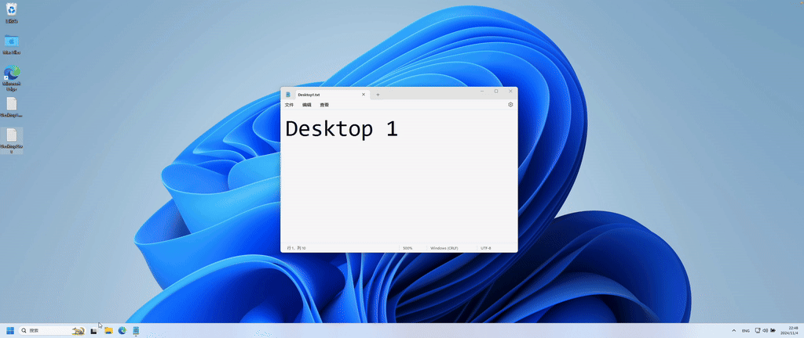

# Hotcorners

## 💡 简介

轻量级的 Windows 角落热区工具。你可以像在 macOS 中那样使用“触发角”，当将指针移动到角落时快速启动操作。例如，你可以设置当将指针移动到屏幕右上角时切换到下一个虚拟桌面，或者当将指针移动到屏幕右下角时打开 Notepad。它不仅支持自定义热键，还支持自定义命令。

‍


## 🔎 使用方法

修改 `hotcorners.ini`​ 文件以自定义热区动作，以下是一个示例配置：

```ini
[TopLeft]
type=hotkey
content=Ctrl+Win+Left

[TopRight]
type=hotkey
content=Ctrl+Win+Right

[BottomLeft]
type=cmd
content=D:\hotkeys.exe Win

[BottomRight]
type=cmd
content=notepad.exe
delay=1000
```

其中配置项解释如下：

|**配置项**|值|**描述**|
| ---------| --------| ---------------------------------------------------------------------------------------------------------------------------|
|type|​`hotkey`​|快捷键|
||​`cmd`​|命令行|
|content|-|当 type 为 hotkey 时，表示快捷键，同组快捷键使用 `+`​ 号连接，多组快捷键中使用 `,`​ 隔开；当 type 为 cmd 时，表示自定义命令行|
|delay|number|动作延迟，以毫秒为单位|

## 🗺️ 键盘映射

此表格将键按类别进行组织，以便更轻松地确定它们在代码中的用途和用法。

|**类别**|**键名称**|**描述**|
| --| ----------------------------------------------| ----------------------------------------------|
|**修饰键**|​`Ctrl`​, `LCtrl`​, `RCtrl`​|Control 键（通用，左，右）|
||​`Shift`​, `LShift`​, `RShift`​|Shift 键（通用，左，右）|
||​`Alt`​, `LAlt`​, `RAlt`​|Alt 键（通用，左，右）|
||​`Win`​, `RWin`​|Windows 键（左，右）|
|**方向键**|​`Left`​, `Right`​, `Up`​, `Down`​|方向箭头键|
|**字母键**|​`A`​ - `Z`​|字母 A 到 Z|
|**数字键**|​`0`​ - `9`​|主键盘上的数字键|
|**功能键**|​`F1`​ - `F12`​|功能键|
|**小键盘键**|​`Num0`​ - `Num9`​|小键盘上的数字键|
||​`NumLk`​, `Div`​, `Mul`​, `Sub`​, `Add`​, `Dec`​|小键盘锁、除号、乘号、减号、加号、小数点|
|**控制键**|​`Esc`​, `Tab`​, `Caps`​, `Space`​, `Enter`​, `Bksp`​|Escape, Tab, 大写锁定，空格，回车，退格键|
|**编辑键**|​`Ins`​, `Del`​, `Home`​, `End`​, `PgUp`​, `PgDn`​|插入，删除，主页，结束，向上翻页，向下翻页|
|**标点符号键**|​`SColon`​, `Plus`​, `Comma`​, `Minus`​, `Dot`​, `Slash`​, `Tilde`​, `LBrack`​, `Bslash`​, `RBrack`​, `Quote`​|各种标点符号，如 ; + , - . / ~ [ \\ ] '|
|**特殊键**|​`PrtSc`​, `Scroll`​, `Pause`​, `Menu`​|Print Screen, Scroll Lock, Pause, 应用菜单键|

## 🙏 鸣谢

灵感来源：

* [https://github.com/taviso/hotcorner](https://github.com/taviso/hotcorner)
